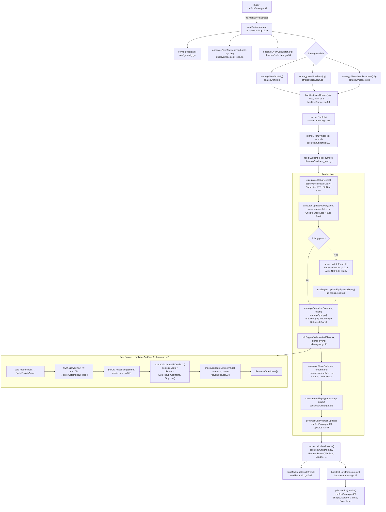
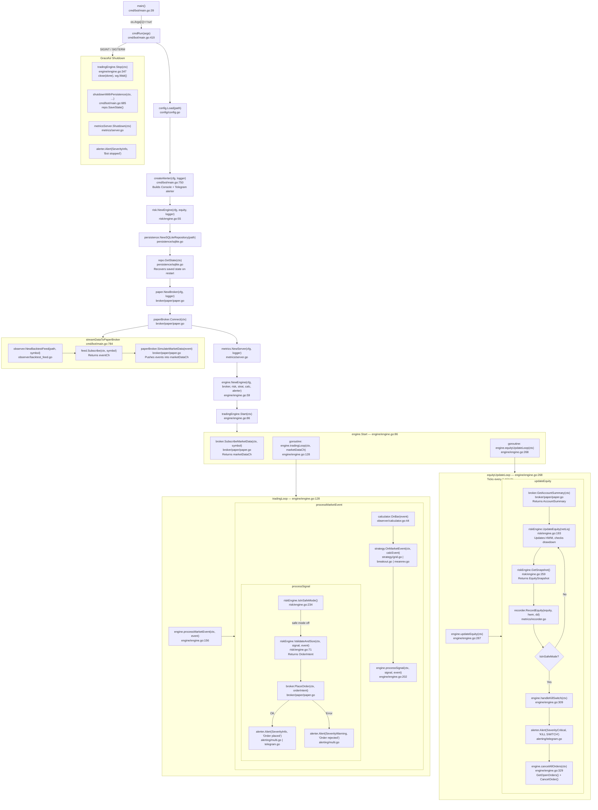
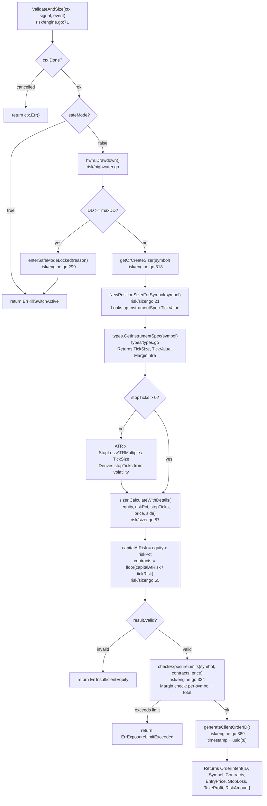

# Function Map — Quant Bot Call Graph

> All major functions annotated with file:line, and interaction diagrams.
> Open in VSCode Markdown Preview or GitHub to render Mermaid diagrams.

---

## 1. Backtest Flow (`quant-bot backtest`)



---

## 2. Live / Paper Trading Flow (`quant-bot run`)



---

## 3. Risk Engine — ValidateAndSize Internal Flow



---

## 4. Function Index by File

### `cmd/bot/main.go`
| Function | Line | Description |
|----------|------|-------------|
| `main()` | 39 | Entry point, dispatches to sub-commands |
| `cmdBacktest(args)` | 219 | Wires components and runs backtest |
| `cmdRun(args)` | 419 | Wires components and starts live/paper engine |
| `createAlerter(cfg, logger)` | 750 | Builds multi-channel alerter (console + Telegram) |
| `streamDataToPaperBroker(...)` | 784 | Streams CSV rows into paper broker at configurable speed |
| `shutdownWithPersistence(...)` | 685 | Ordered shutdown: save state → close connections |
| `printBacktestResults(result)` | 395 | Prints summary table to stdout |
| `printMetrics(metrics)` | 409 | Prints Sharpe, Sortino, Calmar, Expectancy |
| `selectStrategy()` | 95 | Interactive terminal menu for strategy selection |
| `countCSVLines(path)` | 376 | Counts data rows in CSV for progress display |

### `internal/engine/engine.go`
| Function | Line | Description |
|----------|------|-------------|
| `NewEngine(...)` | 59 | Constructor — injects all dependencies |
| `Start(ctx)` | 86 | Subscribes to market data, launches goroutines |
| `tradingLoop(ctx, ch)` | 128 | Receives MarketEvent, drives the signal pipeline |
| `processMarketEvent(ctx, event)` | 156 | Calculator → Strategy → Signal dispatch |
| `processSignal(ctx, signal, event)` | 202 | Risk check → order placement → alerting |
| `equityUpdateLoop(ctx)` | 268 | Polls equity from broker every minute |
| `updateEquity(ctx)` | 287 | GetAccountSummary → UpdateEquity → drawdown check |
| `handleKillSwitch(ctx)` | 309 | Sends critical alert + cancels all open orders |
| `cancelAllOrders(ctx)` | 329 | Fetches and cancels every open order |
| `Stop(ctx)` | 347 | Signals goroutines to stop, waits for clean exit |

### `internal/risk/engine.go`
| Function | Line | Description |
|----------|------|-------------|
| `NewEngine(cfg, equity, logger)` | 55 | Initialises HWM = initialEquity |
| `ValidateAndSize(ctx, signal, event)` | 71 | **Core gate** — returns OrderIntent or error |
| `UpdateEquity(equity)` | 193 | Advances HWM, triggers safe mode if drawdown exceeded |
| `UpdatePosition(position)` | 213 | Maintains in-memory position map |
| `IsInSafeMode()` | 234 | Thread-safe kill-switch status read |
| `EnterSafeMode(reason)` | 241 | Manual kill-switch trigger |
| `GetSnapshot()` | 259 | Returns current equity, HWM, drawdown ratio |
| `enterSafeModeLocked(reason)` | 299 | Internal — requires lock held by caller |
| `getOrCreateSizer(symbol)` | 318 | Lazy-initialises PositionSizer per symbol |
| `checkExposureLimits(...)` | 334 | Margin-based exposure check: per-symbol and total |
| `generateClientOrderID()` | 389 | Produces `YYYYMMDD-HHMMSS-uuid[:8]` for idempotency |

### `internal/risk/sizer.go`
| Function | Line | Description |
|----------|------|-------------|
| `NewPositionSizer(tickValue)` | 14 | Constructor |
| `NewPositionSizerForSymbol(symbol)` | 21 | Looks up InstrumentSpec for tick value |
| `Calculate(equity, riskPct, stopTicks)` | 47 | `floor(equity × risk / stopTicks × tickValue)` |
| `CalculateWithDetails(...)` | 87 | Full result: Contracts, StopLoss price, RiskAmount |
| `MaxContracts(equity, maxPct, price, pointVal)` | 146 | Exposure ceiling in contract units |
| `AdjustForMaxSize(calculated, max)` | 173 | `min(calculated, max)` |

### `internal/risk/highwater.go`
| Function | Line | Description |
|----------|------|-------------|
| `NewHighWaterMarkTracker(initial)` | — | Sets initial peak = starting equity |
| `Update(equity)` | — | Advances peak if equity > current peak |
| `Drawdown()` | — | Returns `(peak - current) / peak` |
| `Snapshot()` | — | Returns (current, peak, drawdown) atomically |
| `Current()` | — | Current equity value |
| `Peak()` | — | All-time high equity |

### `internal/backtest/runner.go`
| Function | Line | Description |
|----------|------|-------------|
| `NewRunner(cfg, feed, calc, strat, ...)` | 80 | Creates runner, wires riskEngine + SimulatedExecutor |
| `Run(ctx)` | 116 | Delegates to RunSymbol("") |
| `RunSymbol(ctx, symbol)` | 121 | **Main backtest loop** — processes every bar |
| `updateEquity(equity, fill, ts)` | 224 | Adds NetPL, notifies risk engine |
| `recordEquity(ts, equity)` | 246 | Appends EquityPoint to the equity curve |
| `calculateResults()` | 260 | Aggregates WinRate, MaxDD, TotalReturn into Result |
| `Reset()` | 328 | Clears state for multi-run scenarios |

### `internal/backtest/metrics.go`
| Function | Line | Description |
|----------|------|-------------|
| `NewMetrics(result, riskFreeRate)` | 18 | Constructor |
| `SharpeRatio()` | 28 | `(mean_return - rf) / stddev × √252` |
| `SortinoRatio()` | 54 | Uses downside deviation only |
| `MaxDrawdown()` | 77 | Scans equity curve for peak-to-trough max |
| `CalmarRatio()` | 101 | `annualReturn / maxDrawdown` |
| `AnnualizedReturn()` | 112 | `(1 + totalReturn)^(365/days) - 1` |
| `WinRate()` | 145 | `wins / totalTrades` |
| `ProfitFactor()` | 161 | `grossProfit / grossLoss` |
| `Expectancy()` | 220 | `winRate × avgWin + lossRate × avgLoss` |

### `internal/observer/calculator.go`
| Function | Line | Description |
|----------|------|-------------|
| `NewCalculator(cfg)` | 34 | Creates ATR, StdDev, SMA indicator instances |
| `OnBar(event)` | ~44 | Feeds price into indicators, returns enriched MarketEvent |
| `CurrentATR()` | — | Returns the latest ATR value |

### `internal/execution/simulated.go`
| Function | Line | Description |
|----------|------|-------------|
| `NewSimulatedExecutor(cfg)` | 47 | Initialises positions and openOrders maps |
| `PlaceOrder(ctx, orderIntent)` | — | Stores order, enforces clientOrderID idempotency |
| `UpdateMarket(event)` | — | Checks Stop-Loss / Take-Profit for each open order |
| `GetTrades()` | — | Returns slice of closed Trade records |
| `Reset()` | — | Clears all state for a fresh run |

---

## 5. Single-Bar Data Flow

```
CSV row
  │
  ▼
BacktestFeed.Subscribe()           observer/backtest_feed.go
  │  MarketEvent{OHLCV}
  ▼
Calculator.OnBar(event)            observer/calculator.go
  │  MarketEvent{OHLCV + ATR + SMA + StdDev}
  ▼
SimulatedExecutor.UpdateMarket()   execution/simulated.go
  │  []OrderResult  (Stop-Loss / Take-Profit fills)
  ▼
Runner.updateEquity(fill)          backtest/runner.go:224
  │  newEquity = equity + NetPL
  │  RiskEngine.UpdateEquity()     risk/engine.go:193
  │    └── HWM.Update() → check drawdown → enterSafeMode?
  ▼
Strategy.OnMarketEvent(ctx, event) strategy/grid.go
  │  []Signal
  ▼
RiskEngine.ValidateAndSize()       risk/engine.go:71
  │  checks: safeMode, drawdown, position size, exposure
  │  Returns OrderIntent{Contracts, EntryPrice, StopLoss, TakeProfit}
  ▼
SimulatedExecutor.PlaceOrder()     execution/simulated.go
  │  OrderResult{Status: Filled | Rejected}
  ▼
Runner.recordEquity(ts, equity)    backtest/runner.go:246
  │  EquityPoint{Timestamp, Equity, Drawdown}
  ▼
ProgressCallback(ProgressUpdate)   cmd/bot/main.go:322
  └── BacktestUI.UpdateStats() + Render()
```
